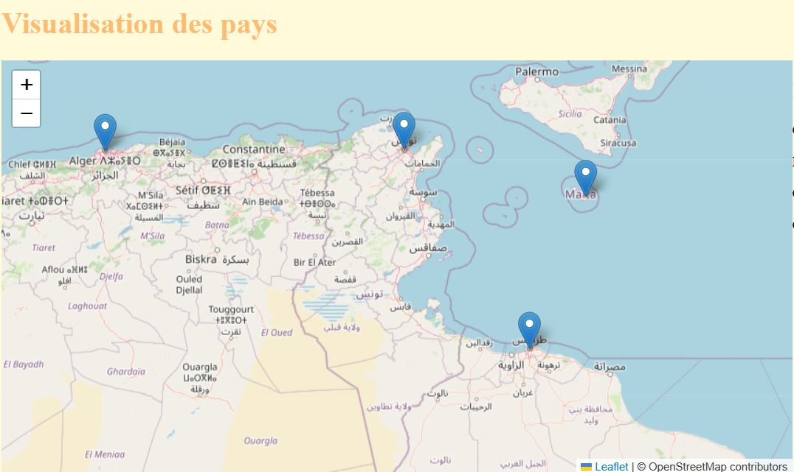
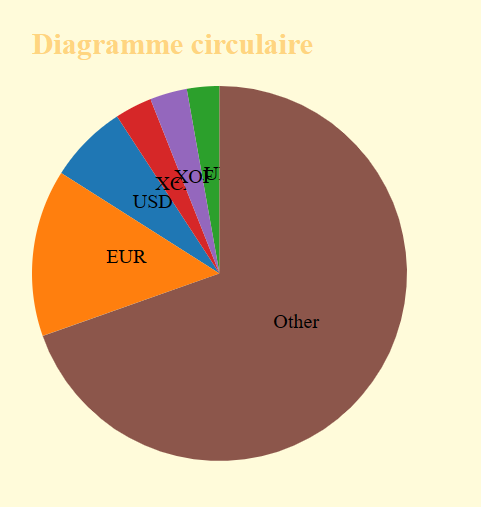
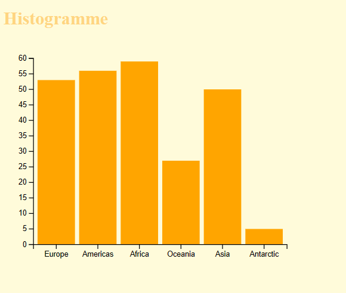

# Projet_D3.js
# Rates Currency info

This project is aimed at visualizing currency information along with country details using D3.js for data visualization and Leaflet for mapping.

## Features
Interactive map displaying country capitals.
Information display for selected countries including currency, region, and official name.
Visualization of currency rates against USD, EUR, and GBP.
Pie chart summarizing currency distribution.
Histogram depicting the distribution of countries by region.

## Technologies Used

- HTML
- JavaScript
- D3.js for data visualization
- Leaflet for mapping

## Integration of Two APIs

-This project utilizes two distinct APIs to gather necessary data and create visualizations:

--Countries API: To gather information about countries such as names, capitals, currencies, regions, etc., we utilized the RESTful countries API https://restcountries.com/v3.1/all?fields=name,capital,currencies,capitalInfo,region. This API provides detailed data about countries from which we extract the required information for visualization.

--Exchange Rate API: In order to obtain currency exchange rates against USD, EUR, and GBP, we utilized the FastForex exchange rate API https://api.fastforex.io/fetch-multi. This API allows us to quickly and easily fetch current exchange rates for the selected currencies.
By combining data provided by these two APIs, we can create information-rich visualizations such as the interactive map of capitals, detailed information about selected countries, summary of currency distribution in the form of a pie chart, and distribution of countries by region in the histogram.

The use of these two APIs enriches the visualizations by providing accurate and up-to-date data about countries and exchange rates, enabling users to explore and understand global trends in currencies and geography.

## Installation

To install and run the project locally, use the following steps:

1. Clone the repository:

git clone https://github.com/rami4real/Projet_D3.js

2. Open the project in a web browser or a local server.

## Usage Examples

- *Map*:  The map visualization displays country capitals as markers on a geographical map. Each marker represents the location of a country's capital. When clicked, a popup appears showing the name of the capital.
.
- *infos*:  This section provides information about the selected country. It includes:
Currency: Displays the currency used in the selected country.
Region: Shows the region to which the country belongs.
Official Name: Displays the official name of the country.
Currency Rates: Provides the currency exchange rates of the selected country against USD, EUR, and GBP.
.
- *pie Summary*: This visualization presents a pie chart summarizing the distribution of currencies among the countries. Each currency is represented by a segment in the pie chart, showing the proportion of countries using that currency.
.

- *Histogramme*:  The histogram displays the distribution of countries by region. Each bar in the histogram represents a region, and the height of the bar corresponds to the number of countries in that region.
.
